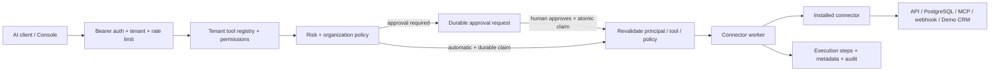

# Architecture

The console is a Supabase-authenticated client. Membership resolution happens in the gateway; browser-supplied organization IDs do not confer access. Scoped API keys bind to one organization and an explicit list of tool names, and cannot administer organizations or approve requests.

`PostgresDatabase.tenant()` begins a transaction, assumes the non-superuser `omnimcp_gateway` role, and sets a transaction-local organization UUID. RLS enforces that UUID independently of explicit organization predicates in SQL. Tenant-owned references use composite `(organization_id, id)` foreign keys. The narrowly used system connection resolves verified membership, hashes for API-key authentication, installed connectors, webhook connection identity, and rate buckets.

The MCP core accepts a `GatewayDispatcher` interface and has no dependency on a specific connector or application service. It constructs an official SDK server for each request via `createMcpHandler`, rejects legacy protocol traffic, and maps the caller's allowed registry rows to `tools/list`. MCP and manual calls use the same execution service.

Execution arguments are encrypted while pending/running and bound to the tenant and execution UUID with AEAD. Only redacted arguments are available to the console; raw results are returned to the immediate caller and are not stored in logs. Durable result metadata contains only type/size. A retry with the same idempotency key returns the recorded status/metadata, not the original raw result.

Approval decisions lock the approval and execution in one transaction. Exactly one transition from pending to running succeeds. Rejected/expired requests erase their encrypted arguments and cannot dispatch. The original principal, current key revocation/membership, connection/tool enablement, permissions, schema and current approval requirement are rechecked before dispatch. CRITICAL always needs approval, regardless of organization policy.

External side effects and PostgreSQL commits are not a distributed transaction. A crash after upstream success can leave an ambiguous result. The gateway never automatically retries it. `executions:reconcile` marks stale running claims unknown and expires pending approvals. The upstream receives an execution-derived idempotency key where the protocol supports it; custom connectors must preserve that key. An operator reconciles unknown outcomes before a new request.

V1.1 runs each connector job in a separate disposable Node process. Gateway owns authentication, policy and the durable execution record; the worker atomically claims dispatch and returns a bounded result or sanitized error. `WorkerExecutor` allows a future queue/container transport without changing connectors. Modules remain deployment-trusted code: process isolation is not a hostile-plugin sandbox. See [worker boundary](worker-boundary.md) for limits and [OAuth](oauth.md) for the provider-neutral credential lifecycle. Browser automation has a reserved SDK interface but no implementation or registry entry.

The console polls every 15 seconds for approval/execution changes. Supabase Realtime is deliberately not required by the correctness model; no public changefeed includes credential or argument ciphertext.

## V1.3 composition boundaries

`createOmniMCP` is shared by the production entry and example. `AuthProvider`
verifies identity; `TenantResolver` verifies membership/API keys and refreshes the
original actor before dispatch. `SupabaseAuthProvider` and `PostgresTenantResolver`
preserve the existing default behavior.

`ExecutionService` and `ApprovalService` use semantic `ExecutionTransaction`
operations. SQL moved into `PostgresExecutionStore`; its injected
`PostgresAuditStore` participates in the same database transaction. Audit failure
rolls back the execution instead of leaving an unaudited runnable action.
Approval locks and idempotency uniqueness remain database guarantees.
The management `policy(Sql,org)` method remains a compatibility adapter.

MCP core imports neither Supabase nor PostgreSQL. It receives a dispatcher and
verified principal, retains protocol capability errors, and forwards request
cancellation to execution/worker signals. A timeout cannot undo an upstream write.

Each real child worker validates connector discovery metadata, registry-operation
binding, input and optional output schema, risk baseline, abort/deadline and JSON
response size. Credential scrubbing and safe error codes apply at this boundary.
Connector discovery can perform an additional read before execution; account for
that latency and upstream availability when writing connectors.

Alternative stores must implement atomic transitions, rollback and transactional
audit, plus a compatible worker claim adapter. Default management/OAuth/rate-limit
services and child-worker claims still use PostgreSQL; interfaces do not imply
that a complete alternative SaaS backend has been implemented.
