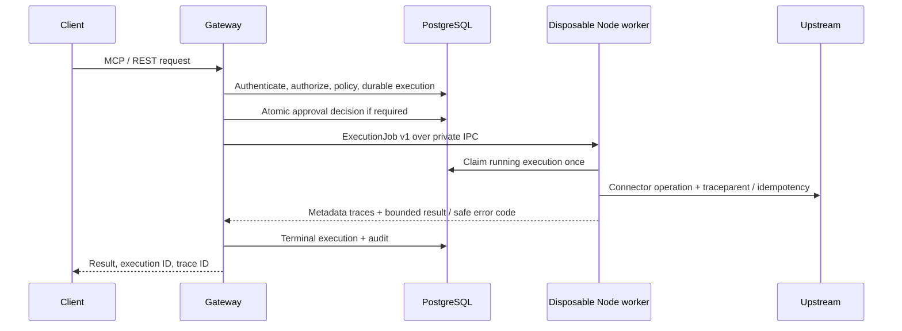

# Connector worker boundary (V1.1)

The normal Gateway starts a `ProcessExecutor`, reads the connector catalog through a child process, and registers proxy connectors. Gateway does not import deployed connector modules. Discovery, initialization, connection tests, schema discovery and execution all cross private Node IPC. There is no public worker endpoint and no separate worker startup command.

`services/connector-worker/src/protocol.ts` defines serializable jobs and the `WorkerExecutor` transport interface. A future queue or remote container adapter replaces this interface, not connector implementations. Such an adapter must authenticate the producer, encrypt transport, preserve tenant/connection/principal bindings, and retain durable claims. The current local IPC channel needs no shared bearer token.

Defaults: four concurrent processes, at most 64 admitted requests including active jobs, 30-second deadline, 192 MiB V8 heap per process, 2 MiB result limit. A worker handles one job and exits. An abort or deadline forcibly kills the child with SIGKILL, including synchronous infinite loops and SIGTERM-ignoring code. Queued jobs respect cancellation. `/health` reports active/waiting workers, capacity, crash count and executor status. This is a process-supervisor health check, not a database/upstream readiness guarantee.

Worker stdout/stderr are discarded; only explicit metadata events and safe error codes cross back. The environment is allowlisted: no Gateway master key, Supabase admin key or caller bearer token is inherited. Only the current connection's decrypted credentials enter the job. The worker receives backend database connectivity for SDK-backed storage (Demo CRM) and execution claims.

**Trust boundary:** this isolates crashes and JavaScript heap exhaustion; it is not a sandbox for malicious plugins. Workers share the OS identity, filesystem and network, and currently receive a privileged backend database URL. Install only reviewed deployment-owned plugins. Untrusted third-party plugins require separate container identities, narrowed database capabilities and filesystem/network restrictions. V8 heap limits do not constrain all native memory allocations. A host/Gateway crash may leave an external effect ambiguous; operator reconciliation is required.

The cold process per job is intentionally simple. It costs startup latency. Use the audit load figures as local evidence, not a production throughput claim. Pooling and durable distributed queues remain future work; no external broker was introduced.
